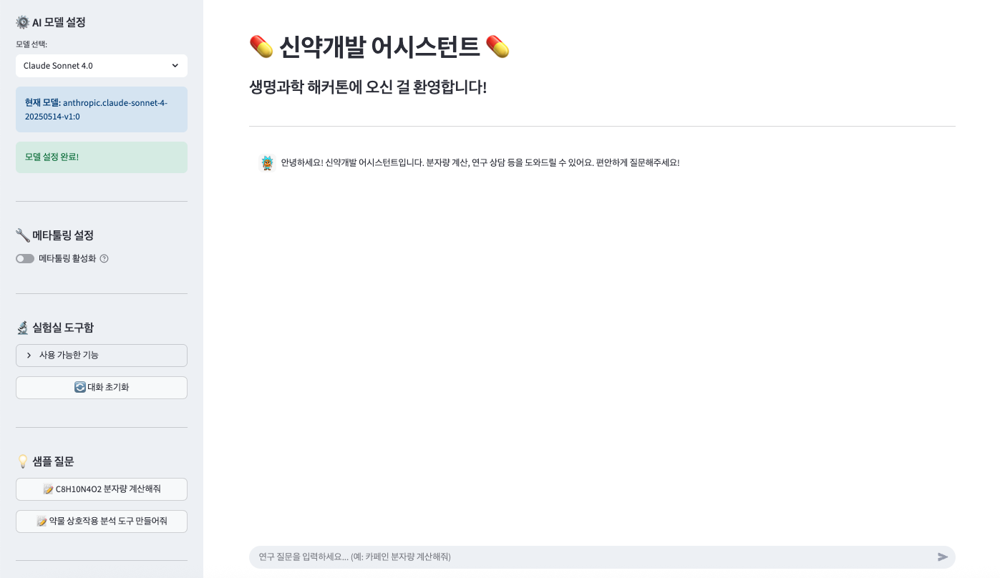

# 🧬 신약개발 어시스턴트 (해커톤 에디션)

Strands Agents를 활용한 위트있는 신약개발 관련 AI 어시스턴트



## 목적
신약개발 해커톤 참가자들의 스트레스 해소와 창의적 영감을 위한 재미있는 도구들을 제공합니다!

## 프로젝트 구조

```
drug-discovery-agents/
├── agents/                     # AI 에이전트 모듈
│   ├── drug_development_agent.py    # 메인 신약개발 에이전트 (예시)
│   ├── meta_tooling_agent.py        # 메타툴링 에이전트 (도구 생성)
│   └── agent_skeleton.py            # 에이전트 템플릿 (starter file)
├── tools/                      # 도구 모듈
│   ├── molecular_calculator.py      # 분자량 계산기 (예시)
│   └── tool_skeleton.py             # 도구 템플릿 (starter file)
├── config/                     # 설정 파일
│   └── settings.py               
├── data/                       # 데이터 및 이미지
│   └── images/
│       ├── ui.png                   
│       └── peccy.jpg                
├── app.py                     # Streamlit 메인 애플리케이션
├── requirements.txt           # Python 패키지 의존성
├── .env.example               # 환경변수 예시 파일
└── README.md                  # 프로젝트 문서
```

## 설치 및 실행

### 1. 가상환경 생성 및 활성화
```bash
# Python 가상환경 생성
python3 -m venv venv

# 가상환경 활성화 (Linux/Mac)
source venv/bin/activate

# 가상환경 활성화 (Windows)
# venv\Scripts\activate
```

### 2. 패키지 설치 및 환경 설정
```bash
# 필요한 패키지 설치
pip install -r requirements.txt

# 환경 변수 파일 복사 및 설정
cp .env.example .env
# .env 파일에 AWS API 키 설정
```

### 3. 애플리케이션 실행
```bash
streamlit run app.py
```

### 4. 가상환경 종료
```bash
# 작업 완료 후 가상환경 비활성화
deactivate
```

## Q CLI 프로필 및 컨텍스트 설정
터미널 상에서 Q CLI를 설정하여 자연어 기반으로 에이전트 개발을 수행할 수 있습니다.

### 초기 설정
```bash
# Q CLI 접근
q chat

# 컨텍스트 파일 추가
/context add context/context.md

# 설정 확인
"현재 프로젝트 구조를 설명해주세요"
"어떤 것부터 시작하면 될까요?"
```

> **💡 참고**: 가상환경을 사용하면 시스템 Python 환경과 분리되어 패키지 충돌을 방지할 수 있습니다.

## Starter 기능

- **분자량 계산기**: 화학식 입력 시 분자량 계산
- **일반 대화**: 신약개발 관련 격려와 위트있는 대화

## 주의사항

이 도구들은 교육 목적입니다. 
실제 의학적 조언이나 신약개발 결정에는 전문가와 상담하세요!
